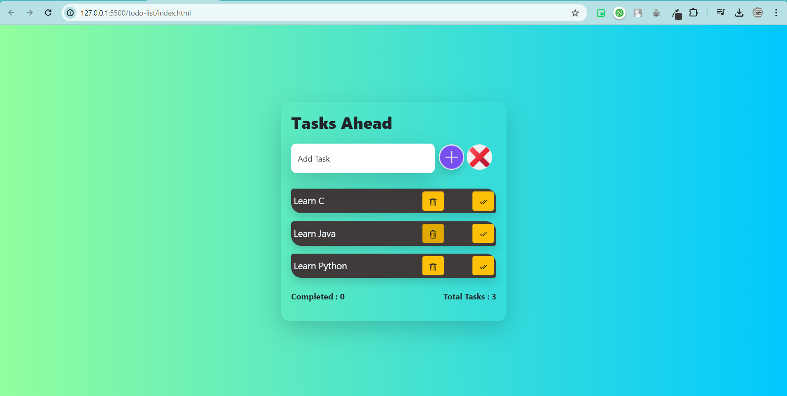
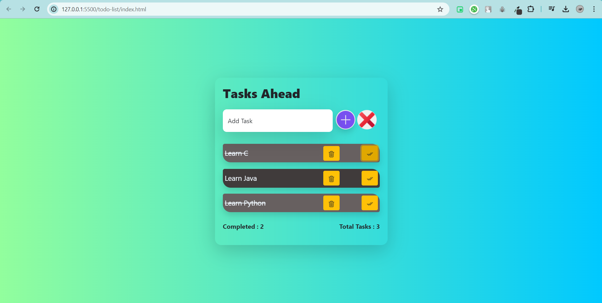

**TITLE:** CodTech IT Solutions Internship - Task Documentation: “To-DO LIST” Using CSS, HTML, JAVASCRIPT.

  

**INTERN INFORMATION:**

  

**Name :** Saran V

**ID :** COD7148

**Domain :** Web Development

**Duration :** 25TH APRIL 2024 to 25TH MAY  2024

  **Mentor :** Sravani Gouni  

  

**INTRODUCTION**

  

In the realm of personal productivity and organizational tools, the to-do list occupies a central role, universally recognized for its simplicity and effectiveness in managing tasks and priorities. The evolution from paper-based lists to digital platforms has significantly expanded the functionality and accessibility of to-do lists, making them an indispensable tool for individuals looking to optimize their time and manage their responsibilities efficiently. This project aims to further innovate in this space by developing a To-Do List application utilizing the power of modern web technologies: JavaScript, HTML, and CSS.

  

The transition to digital to-do lists has opened up a plethora of possibilities for customization, real-time collaboration, and accessibility across devices. Despite the availability of numerous applications in the market, there remains a considerable opportunity to create a more intuitive, user-friendly, and flexible tool that caters to the varied needs of users. This project is driven by the vision to harness the capabilities of JavaScript and the versatility of web technologies to deliver a superior task management experience.

  

**Implementation**

  

- JavaScript Framework: Utilize a modern JavaScript for building the frontend application.

- HTML/CSS: Use HTML5 and CSS3 for structuring and styling the user interface, ensuring compatibility with various web browsers.

- Responsive Design: Implement responsive design principles to ensure optimal viewing experience across desktop and mobile devices.

- User Interface Components: Utilize UI libraries for designing interactive and visually appealing components.

  

**CODE EXPLAINATION**

  

**HTML Structure:**

  

- Acts as the main container for the to-do list application, wrapping everything in a visually appealing background.

  

- Encloses the to-do list's title, input area, and list itself, providing a centered, stylized container for the app components.

- Contains the text input field and the Enter button. Users can type their task here and add it to the list.

  

 The 
 tag where tasks will be displayed as list items (p).

  

**CSS Styling:**

  

The CSS styles define the look and feel of the to-do list, applying a gradient background, styling the input fields, buttons, and tasks.

  

Key styling includes:

  

- Global styles are applied to set margin, padding, and font settings.

- The application is centered on the page with a maximum width and padding for aesthetics.

- Input fields and buttons are styled for a seamless interface, with hover effects for interactivity.

- The .background and .box are styled to center the content and apply specific background colors and paddings.

- Tasks have distinctive styles, with completed tasks being visually different to provide clear feedback on their status.

- Tasks  and other components like the input box and buttons have specific styles for appearance, hover effects, and when a task is marked as completed.

  

**JavaScript Functionality:**

  

The JavaScript adds dynamic behavior to the to-do list, covering task addition, completion marking, and deletion.

  

**Adding Tasks (add function):**

  

Checks if the input field (inputactivity) is empty. If not, it proceeds; otherwise, it alerts the user to enter a task.

  

Creates a new list item (
) and sets its content to the value entered in the input field.

  

Clears the input field after adding the task to the list.

  

**Marking Tasks as Completed:**

  

Utilizes event delegation by adding a click event listener to the list container (inputlist). When a task is clicked, the 'checked' class is toggled on the task, changing its appearance to indicate completion.

  

**Removing Tasks:**

  

The close button (del with '×') added to each task allows users to remove tasks from the list.

  

Initially set up in the add function and further facilitated through a click event listener that sets the task's display style to "none", effectively hiding it.

  

**USAGE**

  

**Adding a Task:** Users enter a task in the input field and click "Enter" to add it to the list.

  

**Marking a Task as Completed:** Users click on a task to toggle its "completed" status.

  

**Removing a Task:** Users click the "×" button on a task to remove it from the list.

  
  

**CONCLUSION**

  

In conclusion, the To-Do List project has successfully delivered a comprehensive task management solution that meets the needs of users seeking to organize their daily tasks effectively. By leveraging modern web technologies, adhering to functional requirements, and incorporating user feedback, the project has laid the foundation for a valuable tool that enhances productivity and organization in both personal and professional settings. With ongoing development and continuous improvement, the To-Do List application is poised to become an indispensable asset for users seeking to optimize their time and manage their responsibilities efficiently.

  
  
  
  
  

**OUTPUT**

1 

2 

3 

 
